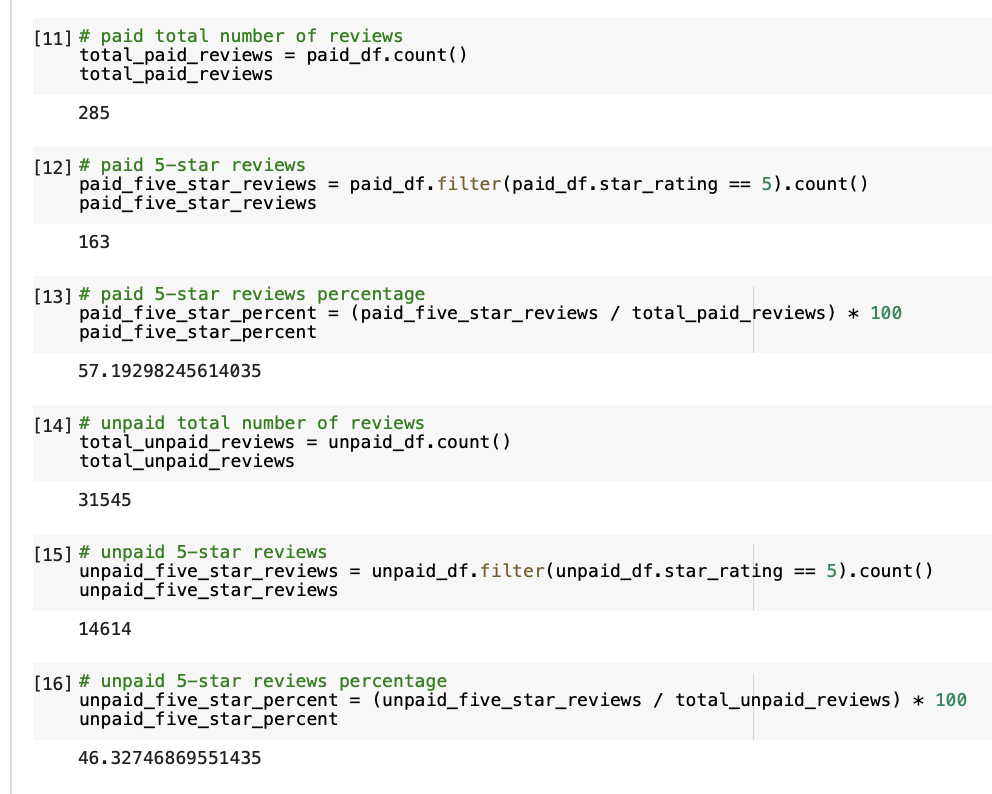

# Amazon_Vine_Analysis
## Overview of the analysis
For this module, we are learning how deal with big data. And the underlying processes of NLP.
We are using dataset from Amazon Reviews and determines if there is a bias toward favorable reviews from Vine members.
By using PySpark, we first perform the ETL to extract the dataset from the amazon reviews from AWS S3, and then transform the data, finally connect to an AWS RDS instance and load the transformed data into pgAdmin sql tables.

## Results

- How many Vine reviews and non-Vine reviews were there?
  Vine reviews: 285
  non-Vine reviews: 31545

- How many Vine reviews were 5 stars? How many non-Vine reviews were 5 stars?
 5 stars Vine reviews: 163
 5 star non-Vine reviews: 14614

- What percentage of Vine reviews were 5 stars? What percentage of non-Vine reviews were 5 stars?
  5 stars Vine reviews percentage: 57.19298245614035%
  5 stars non-Vine reviews percentage: 46.32746869551435%

## Summary

We can tell there are 57.19298245614035% 5 stars Vine reviews, and 46.32746869551435% 5 stars non-Vine reviews.
Therefore, there is little bias to 5 stars Vine reviews.
